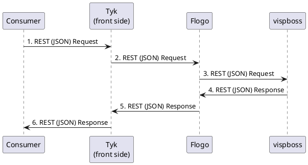

# **Fixed Customer Cancel Order**

## **Business Logic**

### **Summary of the Service**

`This service allows for the cancellation of fixed customer orders based on the provided external ID and reason.`

---

### **Service Information Table**

| Base Path       | Source Repository               | Description       |
| --------------- | ------------------------------- | ----------------- |
| `/`             | `[Fixed Customer Cancel Order](/)` | Service for cancelling fixed customer orders. |

---

## **Overall API Specification**

| Endpoint       | Method       | Description       | Request Body       | Response       | Authentication |
| -------------- | ------------ | ----------------- | ------------------ | -------------- | -------------- |
| `/FixedCustomerOrderCancel_2` | `POST` | `Cancels a fixed customer order.` | `application/json` | `200 OK` / `400 Bad Request` / `404 Not Found` / `500 Internal Server Error` | `Bearer Token` |

---

## **Endpoints Summary**

### **Cancel Fixed Customer Order**

**Endpoint URL:** `/FixedCustomerOrderCancel_2`  
**HTTP Method:** `POST`  
**Authentication:** `Bearer Token`  
**Authorization:** `Required`  
**Description:** `Cancels a fixed customer order based on the provided external ID and reason.`

---

### **Request Header Parameters**

| Parameter Name          | Type     | Required     | Description                                     |
| ----------------------- | -------- | ------------ | ----------------------------------------------- |
| xAPI-correlationID     | string   | true         | Correlation ID associated with the business process |
| xAPI-requestID          | string   | false        | Message request ID                              |
| xAPI-orgTimestamp       | string   | false        | Business process started at                     |
| xAPI-timestamp          | string   | false        | Message generated at                            |
| xAPI-userID             | string   | false        | ID of the human user                            |
| xAPI-serviceProvider     | string   | false        | Name of the service provider for which the business process is applicable |
| xAPI-searchKey          | string   | false        | Search key                                     |
| xAPI-serviceName        | string   | false        | The service name                               |

**Sample Request**

```json
{
    "externalId": "123456",
    "reason": "Customer request",
    "userId": "user_001",
    "requester": "system"
}
```

---

### **Response Parameters**

| Field Name     | Type     | Description                           |
| -------------- | -------- | ------------------------------------- |
| resultCode     | integer  | Code indicating the result of the operation |
| resultText     | string   | Message detailing the result          |

**Sample Response**

```json
{
    "resultCode": 0,
    "resultText": "New order status is :Cancelled"
}
```

---

### **Data Mapping**

#### Request Mapping (includes all XSLT mappings)
| **Target Field and Path** | **Source Path with context** | **Target Element** | **Description** |
|----------------------------|------------------------------|--------------------|------------------|
| /fixedCustomerOrderCancelTemplate/externalId | /externalId | externalId | Direct mapping from source externalId |
| /fixedCustomerOrderCancelTemplate/reason | /reason | reason | Direct mapping from source reason |
| /fixedCustomerOrderCancelTemplate/userId | /userId | userId | Direct mapping from source userId |
| /fixedCustomerOrderCancelTemplate/requester | /requester | requester | Direct mapping from source requester |

#### Additional TIBCO-5 Mapping (previously Request Mapping)
| **Destination**  | **Source** | **Description** | **TIBCO 5 source file** |
|------------------|------------|-----------------|--------------------------|
| $ProcessDataIn/root | $ProcessDataIn/root | Input data for the process | Wrapper_Action_OrderCancel_1.process |
| $StaticProcessData/root/inputXsdSchemaLocation | $StaticProcessData/root/inputXsdSchemaLocation | Input XSD Schema Location | Wrapper_Action_OrderCancel_1.process |
| $StaticProcessData/root/outputXsdSchemaLocation | $StaticProcessData/root/outputXsdSchemaLocation | Output XSD Schema Location | Wrapper_Action_OrderCancel_1.process |
| $StaticProcessData/root/usedXsd | $StaticProcessData/root/usedXsd | Used XSD | Wrapper_Action_OrderCancel_1.process |
| $Call-Action_OrderCancel_1_1/root | $Call-Action_OrderCancel_1_1/root | Output from Call Action Order Cancel 1 | Wrapper_Action_OrderCancel_1.process |
| $ErrorHandler/root/newOutput | $ErrorHandler/root/newOutput | New output from Error Handler | Wrapper_Action_OrderCancel_1.process |
| $Parse-newOutput/root | $Parse-newOutput/root | Parsed new output | Wrapper_Action_OrderCancel_1.process |
| $ErrorHandler/root/newInput | $ErrorHandler/root/newInput | New input from Error Handler | Wrapper_Action_OrderCancel_1.process |
| $Parse-newInput/root | $Parse-newInput/root | Parsed new input | Wrapper_Action_OrderCancel_1.process |
| $Call-Action_OrderCancel_1_2/root | $Call-Action_OrderCancel_1_2/root | Output from Call Action Order Cancel 2 | Wrapper_Action_OrderCancel_1.process |
| $Start/root | $Start/root | Input data from Start | Wrapper_Action_OrderCancel_1.process |
| $Create-REST-header/root/Header/xAPI-correlationID | $Create-REST-header/root/Header/xAPI-correlationID | Correlation ID header | Action_OrderCancel_1.process |
| $Create-REST-header/root/Header/xAPI-requestID | $Create-REST-header/root/Header/xAPI-requestID | Request ID header | Action_OrderCancel_1.process |
| $Create-REST-header/root/Header/xAPI-businessComponent | $Create-REST-header/root/Header/xAPI-businessComponent | Business Component header | Action_OrderCancel_1.process |
| $Create-REST-header/root/Header/xAPI-orgTimestamp | $Create-REST-header/root/Header/xAPI-orgTimestamp | Org Timestamp header | Action_OrderCancel_1.process |
| $Create-REST-header/root/Header/xAPI-timestamp | $Create-REST-header/root/Header/xAPI-timestamp | Timestamp header | Action_OrderCancel_1.process |
| $Create-REST-header/root/Header/xAPI-userID | $Create-REST-header/root/Header/xAPI-userID | User ID header | Action_OrderCancel_1.process |
| $Create-REST-header/root/Header/xAPI-priority | $Create-REST-header/root/Header/xAPI-priority | Priority header | Action_OrderCancel_1.process |
| $Create-REST-header/root/Header/xAPI-serviceName | $Create-REST-header/root/Header/xAPI-serviceName | Service Name header | Action_OrderCancel_1.process |
| $Create-REST-header/root/Header/xAPI-version | $Create-REST-header/root/Header/xAPI-version | Version header | Action_OrderCancel_1.process |
| $Create-REST-header/root/Header/xAPI-serviceProvider | $Create-REST-header/root/Header/xAPI-serviceProvider | Service Provider header | Action_OrderCancel_1.process |
| $Start/root/requestText | $Start/root/requestText | Request text | Action_OrderCancel_1.process |
| $Start/root/contentType | $Start/root/contentType | Content Type | Action_OrderCancel_1.process |
| $Start/root/errorCode | $Start/root/errorCode | Error Code | Lib_log_error_1.process |
| $Start/root/errorDescription | $Start/root/errorDescription | Error Description | Lib_log_error_1.process |
| $Get-Process-variable/root/processData/starterName | $Get-Process-variable/root/processData/starterName | Starter Name | ErrorHandler.process |
| $xsd/usedXsd/schemaLocation | $xsd/usedXsd/schemaLocation | XSD Location | ErrorHandler.process |
| $xsd/usedXsd/xsd | $xsd/usedXsd/xsd | XSD Content | ErrorHandler.process |
| $Start/root/error | $Start/root/error | Error Data | ErrorHandler.process |
| $Start/root/processName | $Start/root/processName | Process Name | ErrorHandler.process |

### Sample Success and Error Messages

**Sample Success (HTTP Code: 200):**
```json
{
    "resultCode": 0,
    "resultText": "New order status is :Cancelled"
}
```

**Sample Error (HTTP Code: as defined in error code table):**
```json
{
    "errors": {
        "error": [
            "Mandatory element missing. Please provide the correlation Id in the request"
        ]
    },
    "status": 30,
    "title": "Validation Error"
}
```

---

### **Error Codes**

| HTTP Code | Message     | Description                                     |
| --------- | ----------- | ----------------------------------------------- |
| 200       | Success     | Order cancellation successful.                  |
| 400       | Bad Request  | Validation error occurred.                      |
| 404       | Not Found   | The specified order could not be found.        |
| 500       | Internal Server Error | An unexpected error occurred.            |

---


## **PlantUML**



---

### **Explanation**

1. **Actors & Participants** — `Consumer, Tyk Front, Flogo, vispboss`
2. **Interactions / Data Flow** — `The consumer sends a request to Tyk, which forwards it to Flogo. Flogo processes the request and communicates with the backend service (vispboss) before returning the response back through Tyk to the consumer.`
3. **Decision Points** — `The flow includes decision points for validation and error handling based on the responses received.`
4. **Messaging / Queues** — `REST API calls are used for communication between the consumer, Tyk, Flogo, and the backend service.`
5. **Responses / Error Handling** — `Responses are structured based on success or error scenarios, with appropriate HTTP status codes and messages.`

---

## **Additional Notes**

* **Validations:** `Ensure all required fields are present in the request.`
* **Integrations:** `Integrate with existing logging and monitoring systems for observability.`
* **Retries & Backoff:** `Implement retry logic for transient errors.`
* **Logging & Monitoring:** `Log all incoming requests and responses for auditing purposes.`
* **Data Consistency:** `Ensure data integrity during the cancellation process.`

---

### Flogo Low Level Design Flow

1. **StartActivity**  
• Acts as the entry point to the flow.  
• If **debug flag = true (`debug_true`)**, proceeds to **LogInputMessage**.  
• If **debug flag = false (`debug_false`)**, proceeds directly to **callValidationFlow**.  
• Independently, also routes to **LogIncomingRequest** for logging incoming requests.  

2. **LogInputMessage**  
• Logs the incoming request details for debugging purposes.  
• Proceeds to **callValidationFlow**.  

3. **LogIncomingRequest**  
• Logs the incoming request for audit and tracing.  
• Proceeds to **callValidationFlow**.  

4. **callValidationFlow**  
• Subflow responsible for validating the incoming request.  
• Proceeds to **RequestPOSTValidation**.  

5. **RequestPOSTValidation**  
• Performs validation specific to **POST** requests.  
• On completion, proceeds to **callcancelOrder**.  

6. **Fixed Customer Cancel Order**  
• Backend subflow/activity that triggers the actual cancellation service.  
• If successful and debug is enabled, proceeds to **LogMessage**.  
• Otherwise (**exprOtherwise**), proceeds directly to **ConfigureHTTPResponse**.  

7. **LogMessage**  
• Logs the backend response or the result of the cancellation service.  
• Proceeds to **ConfigureHTTPResponse**.  

8. **ConfigureHTTPResponse**  
• Builds the final HTTP response.  
• Prepares status code, headers, and response body.  
• Proceeds to **Return**.  

9. **Return**  
• Ends the flow by returning the final response to the client.  

### Design Notes

1. Conditional branching is used for handling **debug flags** and **success/error** outcomes.  
2. The flow separates **validation**, **backend invocation**, and **response configuration** for modularity.  
3. Logging is implemented at key points: input, output, and error stages for observability.  
4. The final response phase consolidates and formats all data into a structured HTTP response.